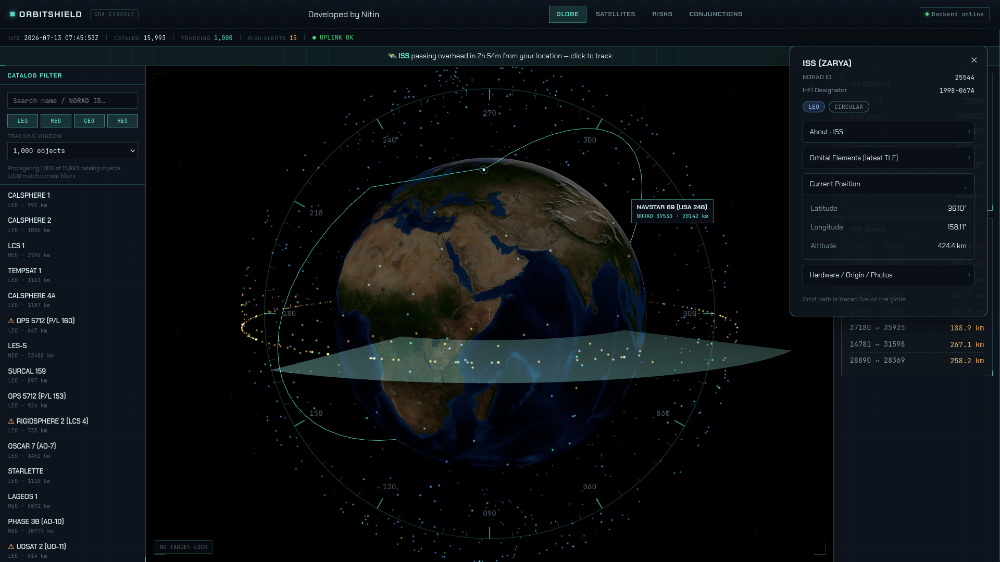
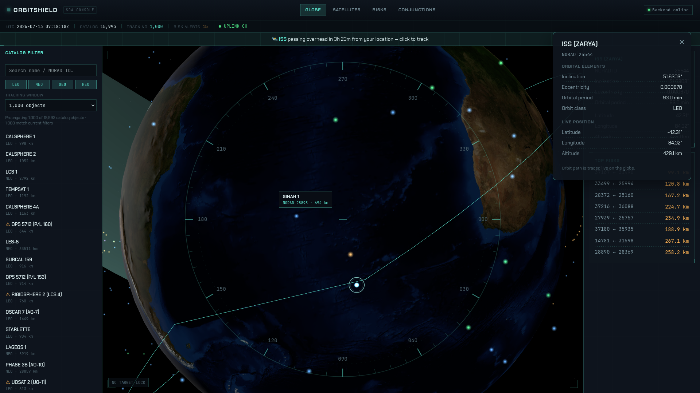
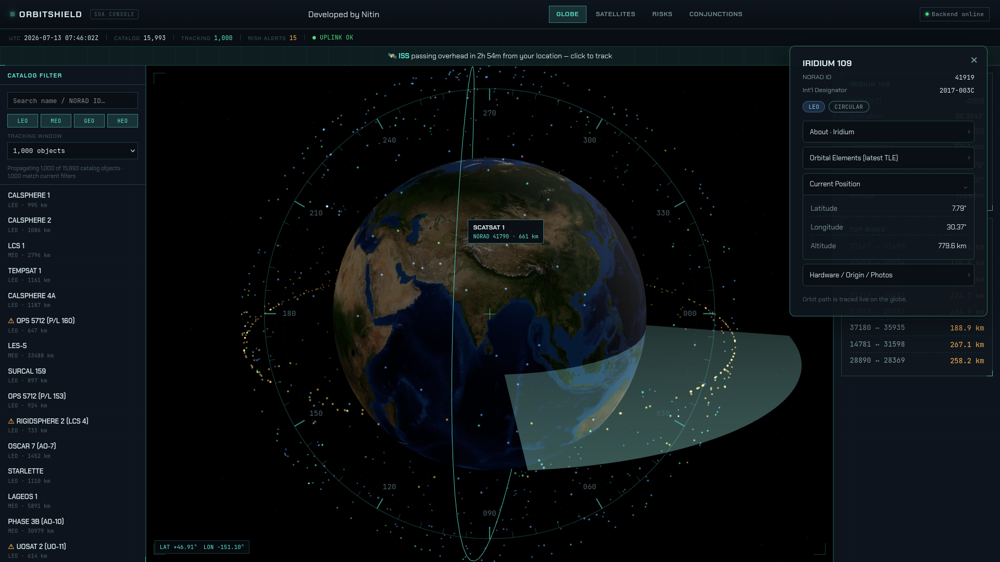
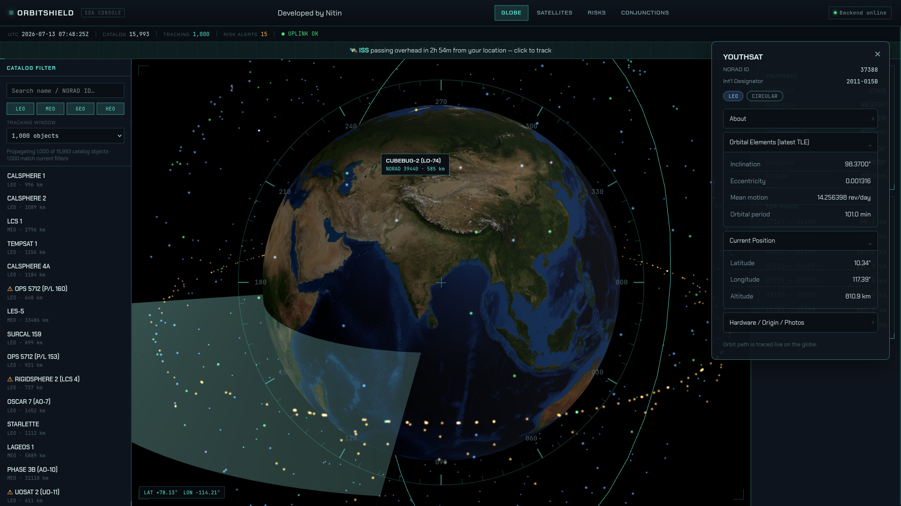
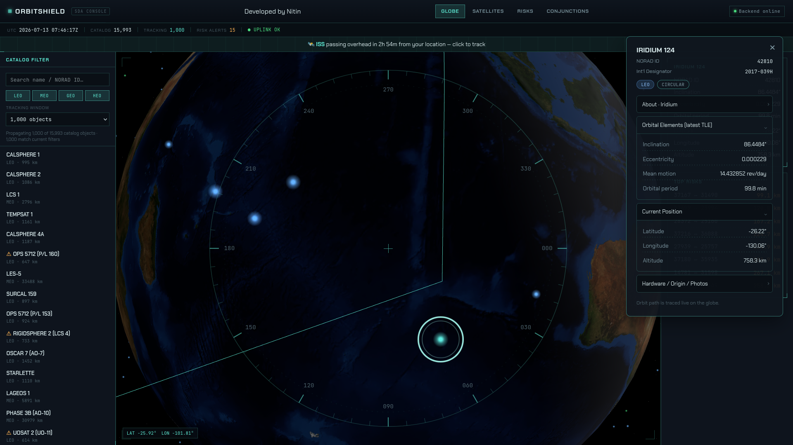
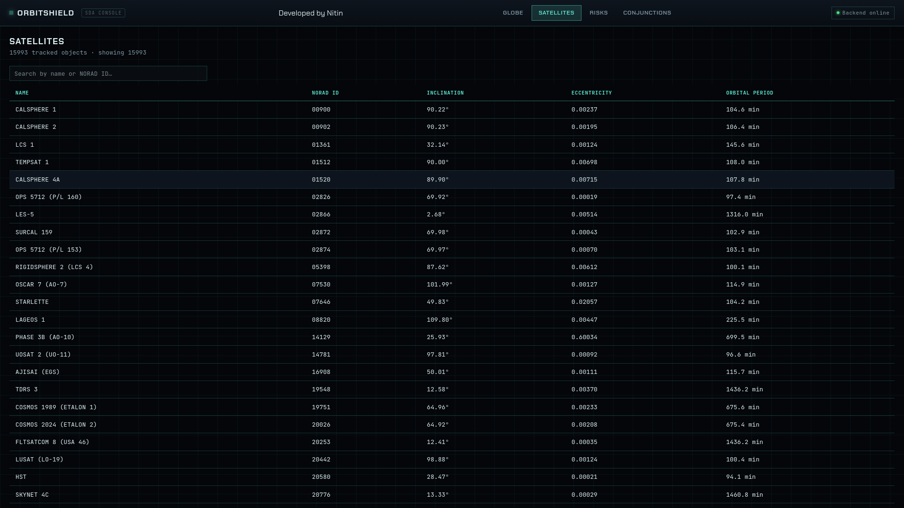
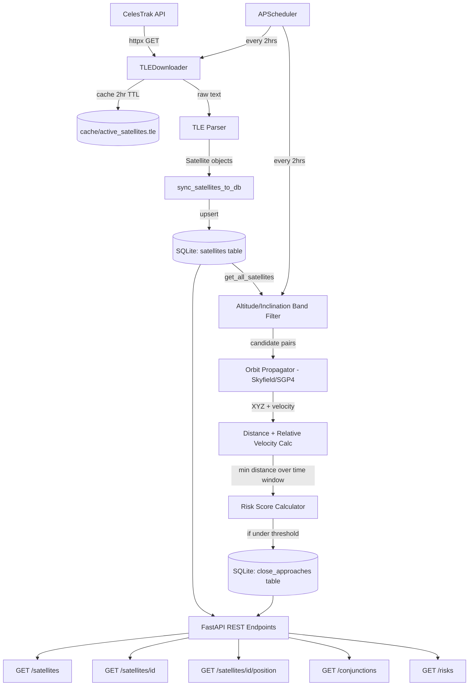

# OrbitShield — Backend Technical Documentation

**Author:** [Nitin](https://github.com/nitin864)

Satellite conjunction (collision) risk prediction system. Ingests live orbital
data, propagates satellite positions using real orbital mechanics, detects
potential close approaches between satellites, scores their risk, and serves
everything through a REST API — with an automated background scheduler
keeping the data fresh.

This document covers everything built so far: architecture, data flow, every
formula used, the filtering/optimization strategy, the database schema, the
API surface, and known limitations.







 

---

## 1. Tech Stack

| Layer | Technology | Purpose |
|---|---|---|
| Language | Python 3.13 | |
| Web framework | FastAPI | REST API |
| Server | Uvicorn | ASGI server running FastAPI |
| HTTP client | httpx | Downloading TLE data from CelesTrak |
| Orbital mechanics | Skyfield + SGP4 | Satellite position/velocity propagation |
| Data validation | Pydantic | In-memory data models (`Satellite`) |
| Database ORM | SQLAlchemy | Table models, queries, sessions |
| Database engine | SQLite | Local file-based persistence (`orbitshield.db`) |
| Scheduler | APScheduler | Automatic background sync/scan jobs |

---

## 2. System Architecture



---

## 3. Folder Structure

```
backend/
├── app/
│   ├── main.py                    # FastAPI app + all route definitions
│   ├── models/
│   │   └── satellite.py           # Pydantic Satellite model (in-memory shape)
│   ├── database/
│   │   ├── database.py            # SQLAlchemy engine, session, Base
│   │   └── models.py              # SatelliteDB, CloseApproachDB table models
│   ├── services/
│   │   ├── tle_downloader.py      # Download + cache + parse TLE data
│   │   ├── sync_service.py        # Upsert parsed satellites into DB
│   │   └── satellite_query_service.py  # All read queries (DB -> Python objects)
│   ├── orbit/
│   │   └── propagator.py          # All Skyfield/SGP4 + altitude math
│   ├── collision/
│   │   ├── distance.py            # Euclidean distance, relative velocity,
│   │   │                          #   closest-approach-over-time search
│   │   ├── risk.py                # Risk score formula
│   │   └── detector.py            # Band grouping + pairwise scan orchestration
│   └── scheduler/
│       └── jobs.py                # APScheduler jobs (sync_job, scan_job)
├── cache/
│   └── active_satellites.tle      # Cached raw TLE download (2hr TTL)
├── orbitshield.db                 # SQLite database file
└── requirements.txt
```

---

## 4. Data Flow, Step by Step

### 4.1 Download (`tle_downloader.py`)

- Source: `https://celestrak.org/NORAD/elements/gp.php?GROUP=active&FORMAT=tle`
- CelesTrak updates this feed **once every 2 hours** and enforces rate limiting
  on repeat requests within that window.
- `TLEDownloader.download()` checks `cache/active_satellites.tle`'s file
  modification time. If younger than 2 hours, reads from disk. Otherwise,
  makes a fresh HTTP GET and overwrites the cache.

### 4.2 Parsing (`tle_downloader.py`)

TLE data is a fixed-width text format — every satellite occupies exactly 3
lines (name, line1, line2), and every field lives at an exact character
position within line1/line2.

Fields extracted, with their exact source positions:

| Field | Source | Example |
|---|---|---|
| `norad_id` | `line1[2:7]` | `25544` |
| `inclination` | `line2[8:16]` | `51.6397` |
| `eccentricity` | `"0." + line2[26:33]` | `0.0023416` (no decimal point in raw TLE — must be inserted) |
| `mean_motion` | `line2[52:63]` | `15.50382134` (orbits/day) |

**Derived field:**
```
orbital_period_minutes = (24 * 60) / mean_motion
```

The full `line1`/`line2` strings are also kept on every `Satellite` object,
because Skyfield's SGP4 propagator needs the raw TLE lines directly — the
extracted numeric fields above are only used for cheap pre-filtering, not for
actual position calculation.

### 4.3 Persistence (`sync_service.py`)

`sync_satellites_to_db()` performs an **upsert** for every parsed satellite:
query by `norad_id` (unique, indexed) -> if found, update fields in place; if
not found, insert a new row. A single `db.commit()` runs once at the end of
the whole batch (not per-row), to keep bulk syncs of ~16,000 satellites fast.

---

## 5. Orbit Propagation

All in `app/orbit/propagator.py`. Core dependency: **Skyfield**, which wraps
the **SGP4** algorithm — the standard model for predicting satellite
positions from TLE data.

### 5.1 Current / arbitrary-time position

```python
sky_satellite = EarthSatellite(line1, line2, name)
geocentric = sky_satellite.at(time)
subpoint = wgs84.subpoint(geocentric)
# -> latitude, longitude, altitude_km
```

`wgs84` is the same Earth reference ellipsoid model used by GPS.

### 5.2 Raw XYZ position + velocity

For distance/collision math, lat/lon/altitude (spherical) is unsuitable —
Euclidean distance needs flat XYZ coordinates, which Skyfield provides
directly:

```python
geocentric.position.km        # (x, y, z) in km, Earth-centered
geocentric.velocity.km_per_s   # (vx, vy, vz) in km/s
```

---

## 6. Cheap Altitude Pre-Filtering (Kepler's Third Law)

Running full SGP4 propagation for every possible satellite pair is
computationally infeasible at scale (see §8). Before doing any expensive
propagation, satellites are bucketed by **estimated altitude**, computed
directly from `mean_motion` — pure arithmetic, no propagation required.

**Formula:**

```
n (rad/s) = mean_motion * 2*pi / 86400
a (semi-major axis, km) = (mu / n^2) ^ (1/3)
altitude_km ≈ a - Earth_radius_km
```

Where:
- `mu` (Earth's gravitational parameter) = `398600.4418 km^3/s^2`
- `Earth_radius_km` = `6378.137 km`
- `mean_motion` is in orbits/day; converted to radians/second (`2*pi` radians
  per orbit, `86400` seconds per day)

This assumes a circular orbit, so it's an approximation — real accuracy is
typically within ~5-10% of the true altitude (verified: CALSPHERE 1's
estimated altitude was ~1061.6 km vs. ~992-995 km from full SGP4 — a known,
accepted margin of error for a cheap filter, not used for final risk
calculations).

**Altitude banding:**
```
altitude_band = floor(altitude_km / band_width_km)     # default width: 50km
```

**Inclination banding** (second filter dimension, same technique):
```
inclination_band = floor(inclination_deg / band_width_deg)   # default width: 5deg
```

Satellites are grouped by the tuple `(altitude_band, inclination_band)`.

---

## 7. Collision Detection Pipeline

### 7.1 Why two-dimensional banding

Two satellites can only physically collide if they occupy similar altitude
**and** similar orbital plane (inclination) at the same time — this is a
hard geometric constraint, not an approximation of convenience. Filtering on
both dimensions before running expensive math is mathematically sound, not
just a speed hack.

### 7.2 Boundary problem and the neighbor-search fix

A satellite's altitude estimate near a band boundary can land in a different
band than a genuinely close neighbor. Confirmed empirically: CALSPHERE 1
(band 19) and CALSPHERE 2 (band 21) — real distance ~1968 km — were
initially missed entirely because they were 2 bands apart, outside a +/-1
neighbor search.

**Fix:** for each band, cross-band pairs are checked against all neighboring
bands within a +/-2 radius (in both altitude and inclination dimensions — a
5x5 = 25-cell neighborhood), not just the exact same band. To avoid
double-counting a pair from both directions, cross-band comparisons only
look "forward" (`neighbor_key > band_key`, using Python tuple comparison).

### 7.3 Closest approach over a time window

```
find_closest_approach(sat1, sat2, hours, step_minutes):
    for each time step across the window:
        get XYZ + velocity for both satellites at that instant
        compute distance
        if this is the smallest distance seen so far:
            record distance, time, and relative velocity at this instant
    return the recorded minimum
```

### 7.4 Distance formula (Euclidean, 3D)

```
distance_km = sqrt[(x2-x1)^2 + (y2-y1)^2 + (z2-z1)^2]
```

### 7.5 Relative velocity formula

Same structure as distance, applied to velocity vectors:

```
relative_velocity_km_s = sqrt[(vx2-vx1)^2 + (vy2-vy1)^2 + (vz2-vz1)^2]
```

### 7.6 Risk score formula

```
if min_distance_km <= 0.001:
    risk_score = 999999.0        # treated as certain/maximum risk (floor
                                  # against division by zero)
else:
    risk_score = relative_velocity_km_s / min_distance_km
```

Rationale: risk increases as distance shrinks toward zero (denominator ->
0) and as relative velocity increases (numerator grows) — a fast crossing at
a given distance is riskier than a slow one. This is a simplified,
explainable first-pass metric, not a full collision-probability model (real
systems also factor in object size and position uncertainty/covariance,
which this project does not model).

### 7.7 Same-structure false-positive filter

**Real bug found and fixed this session:** NORAD IDs `25544` (ISS) and
`25575` (ISS UNITY module) are separate catalog entries for parts of the
*same physical structure*, producing genuine `0.0 km` distances — not sensor
error, not a code bug, but also not a meaningful "collision risk" (two labels
for one object). Fixed with a floor on saved results:

```
save result only if:  0.5 km < min_distance_km < threshold_km
```

---

## 8. Performance: Why the Filtering Strategy Exists

| Approach | Pair count (approx. 16,000 satellites) | Feasibility |
|---|---|---|
| Naive brute force (all pairs) | ~127,800,000 pairs | ~21 days of compute at brute-force propagation cost — infeasible |
| Altitude banding only (single dimension) | Worst single band: ~1,130 satellites -> ~637,885 pairs | Still very slow for the densest band |
| Altitude + inclination banding (two dimensions) | Worst band dropped to ~350-400 satellites in most cases | Tractable for the majority of the dataset |

**Known unresolved limitation:** one real cluster of ~973 satellites shares
near-identical altitude *and* inclination (consistent with a single
mega-constellation deployment, e.g. Starlink). Narrowing the inclination
band width from 5 deg to 1 deg did not meaningfully split this cluster —
confirmed via direct testing, meaning this is genuine physical clustering in
the real data, not a binning artifact. A complete fix would add a third
filtering dimension (RAAN — right ascension of ascending node),
distinguishing satellites that share altitude and inclination but differ in
their position around the orbital plane. **Not implemented** — documented
here as scoped, understood future work rather than silently ignored.

---

## 9. Database Schema

### `satellites` table

| Column | Type | Notes |
|---|---|---|
| `id` | Integer | Primary key |
| `norad_id` | String | Unique, indexed — upsert key |
| `name` | String | |
| `line1` | String | Raw TLE line 1 (needed for propagation) |
| `line2` | String | Raw TLE line 2 |
| `inclination` | Float | Degrees |
| `eccentricity` | Float | |
| `mean_motion` | Float | Orbits/day |
| `orbital_period_minutes` | Float | Derived |

### `close_approaches` table

| Column | Type | Notes |
|---|---|---|
| `id` | Integer | Primary key |
| `satellite_1_norad_id` | String | Indexed |
| `satellite_2_norad_id` | String | Indexed |
| `min_distance_km` | Float | |
| `closest_time_utc` | String | ISO 8601 timestamp of closest approach |
| `risk_score` | Float | See §7.6 |

---

## 10. REST API

| Endpoint | Method | Description |
|---|---|---|
| `/` | GET | Health check |
| `/satellites` | GET | Full satellite catalog (from DB, not live download) |
| `/satellites/{norad_id}` | GET | Single satellite lookup by NORAD ID (404 if not found) |
| `/satellites/{norad_id}/position` | GET | Live SGP4-propagated current position for one satellite |
| `/conjunctions` | GET | All recorded close approaches |
| `/risks` | GET | Close approaches sorted by risk score, descending. Accepts `?limit=N` (default 20) |

All database-backed endpoints read from SQLite, not from a live CelesTrak
call — this keeps response times fast and avoids hitting CelesTrak's rate
limits on every request. Only `/satellites/{norad_id}/position` performs a
live computation per-request (SGP4 propagation), since "current position"
is inherently time-sensitive and can't be pre-computed once and cached the
same way static satellite data can.

---

## 11. Automated Scheduler

`app/scheduler/jobs.py`, using APScheduler's `BackgroundScheduler`, wired
into FastAPI's startup event (`@app.on_event("startup")`).

Two jobs registered on a 2-hour interval (matching CelesTrak's actual GP
data refresh cadence):

- **`sync_job`** — download (or read from cache) -> parse -> upsert into
  `satellites` table
- **`scan_job`** — read all satellites from DB -> run the full band-filtered
  collision detection + risk scoring pipeline -> persist results to
  `close_approaches`

This removes the need for manual pipeline runs — as long as the server
process is running, satellite data and collision/risk results stay current
automatically.

---

## 12. Known Limitations / Honest Gaps

- **RAAN filtering not implemented** (§8) — one dense satellite cluster
  remains a performance bottleneck; documented, not silently hidden.
- **No automated test suite** — all verification during development was
  manual (ad-hoc scripts), not `pytest`-based. No regression safety net yet.
- **No containerization / deployment config** — runs locally only, via
  manually-activated virtual environment.
- **SQLite, not PostgreSQL** — appropriate for development; a production
  deployment would likely migrate to Postgres for concurrent access.
- **No `.env` / externalized configuration** — URLs, cache duration, and
  similar values are currently hardcoded in source rather than
  environment-configurable.
- **Risk score is a simplified heuristic** — real conjunction-assessment
  systems (e.g., Space-Track, LeoLabs) use full collision-probability models
  incorporating object size and position-uncertainty covariance; this
  project's `relative_velocity / distance` formula is an explainable,
  defensible first-pass metric, not an industry-grade probability model.
- **Scheduler registered but not long-run verified** — confirmed to start
  without error; not yet observed completing a full automatic cycle
  unattended.

---

## 13. Running the Backend

```bash
cd backend
source .venv/bin/activate
pip install -r requirements.txt
uvicorn app.main:app --reload
```

Server runs at `http://127.0.0.1:8000`. Interactive API docs (auto-generated
by FastAPI) available at `http://127.0.0.1:8000/docs`.

First run: the `satellites` table will be empty until either the scheduler's
first `sync_job` fires (within 2 hours of startup) or a manual sync is run:

```python
from app.services.tle_downloader import TLEDownloader
from app.services.sync_service import sync_satellites_to_db

downloader = TLEDownloader()
raw = downloader.download()
satellites = downloader.parse(raw)
sync_satellites_to_db(satellites)
```
Developed by Nitin
